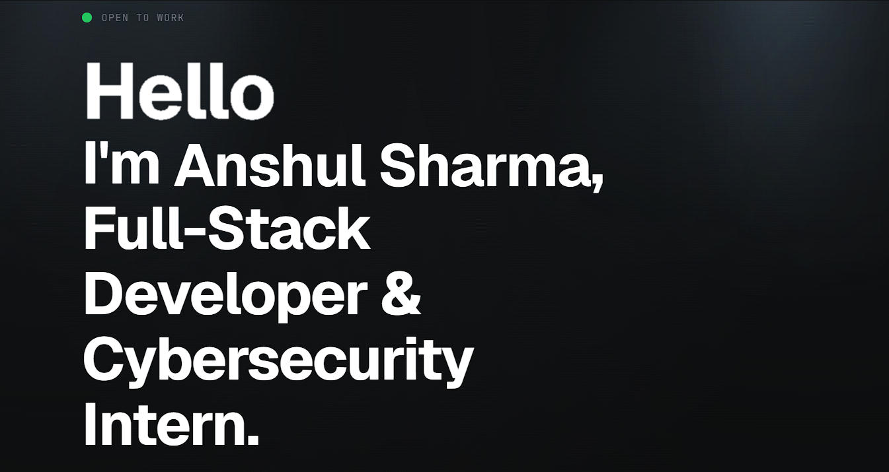
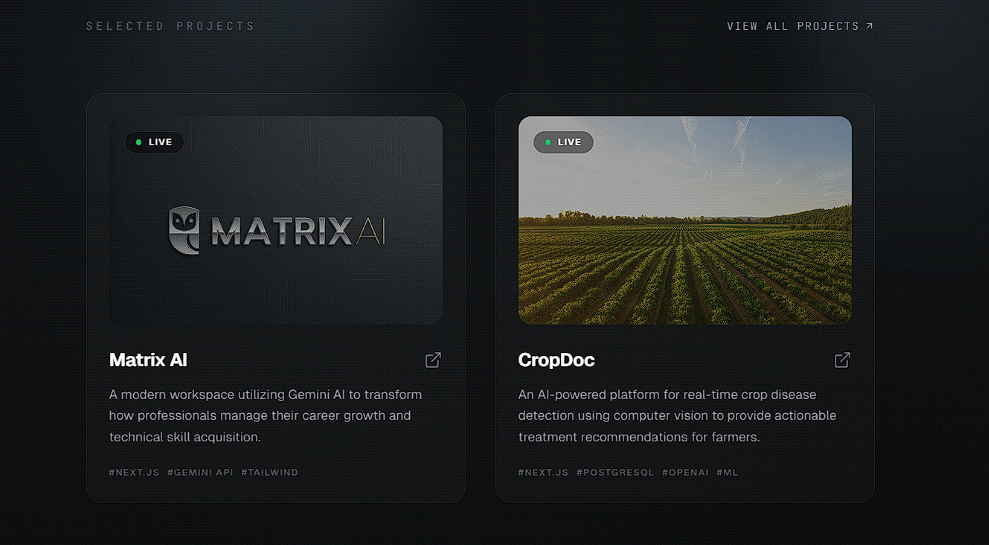

# Anshul Sharma Portfolio

A modern, responsive developer portfolio built with React, TypeScript, Vite, Tailwind CSS, and Motion.  
This project highlights experience, education, tech stack, and featured projects with interactive UI components and smooth animations.


## About This Repository

This repository contains the source code of my personal portfolio website. It is built to present my work, technical background, and projects in a clean and recruiter-friendly format while keeping a strong focus on performance, responsiveness, and modern UI quality.

## Key Achievements

- Responsive experience across mobile, tablet, and desktop layouts
- Interactive sections with production-ready Motion animations
- Security-hardened frontend setup (no client-side secret injection)
- Featured project cards linked to live deployments
- Clean code organization for easy extension and maintenance

## Live Project Highlights

- **Matrix AI**: [https://matrix-ai-psi.vercel.app/](https://matrix-ai-psi.vercel.app/)
- **CropDoc**: [https://crop-doc-rho.vercel.app/](https://crop-doc-rho.vercel.app/)

## Features

- Fully responsive single-page portfolio layout
- Animated hero section with modern UI effects
- Side navigation drawer for quick section access
- Dedicated sections for About, Education, Experience, Stack, and Projects
- Interactive project cards with external links
- Custom typography, iconography, and polished dark theme aesthetics

## Tech Stack

- **Frontend**: React 19, TypeScript, Vite
- **Styling**: Tailwind CSS v4, `tw-animate-css`, custom CSS utilities
- **Animation**: Motion (`motion/react`)
- **UI/Icons**: Lucide React, custom UI components

## Screenshots

> Add your screenshots in `docs/screenshots/` and keep these filenames for automatic rendering.

### Hero Section



### Projects Section



## Project Structure

```text
.
├── docs/
│   └── screenshots/
│       ├── hero-section.png
│       └── projects-section.png
├── public/
│   └── favicon.ico
├── src/
│   ├── components/
│   │   └── ui/
│   ├── img/
│   │   └── matrix-image.png
│   ├── App.tsx
│   ├── index.css
│   └── main.tsx
├── index.html
├── package.json
└── tsconfig.json
```

## Getting Started

### Prerequisites

- Node.js 18+ (recommended latest LTS)
- npm

### Installation

```bash
npm install
```

### Run Development Server

```bash
npm run dev
```

App runs at: `http://localhost:3000`

### Build for Production

```bash
npm run build
```

### Preview Production Build

```bash
npm run preview
```

### Type Check

```bash
npm run lint
```

## Available Scripts

- `npm run dev` - Start local dev server
- `npm run build` - Create production build
- `npm run preview` - Preview production build locally
- `npm run lint` - Run TypeScript type checks
- `npm run clean` - Remove `dist` folder

## Deployment

This project is deployment-ready for static hosting platforms such as:

- Vercel
- Netlify
- GitHub Pages (with Vite static build workflow)

Use the production output from the `dist/` directory after running `npm run build`.

## Contact

- **Author**: Anshul Sharma
- **Email**: [ansh1143@outlook.com](mailto:ansh1143@outlook.com)
- **GitHub**: [https://github.com/Ansh3878](https://github.com/Ansh3878)
- **LinkedIn**: [https://www.linkedin.com/in/anshul-sharma-38999b251](https://www.linkedin.com/in/anshul-sharma-38999b251)

---
